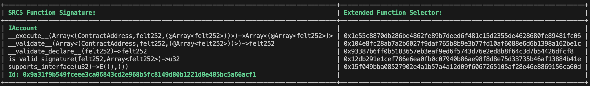

# src5-rs

[](https://crates.io/crates/blockchain-keygen)

## Overview

Utility for generating SRC5 interfaces ids from Cairo traits, using Cairo source code as input.

## Installation

### Cargo

* Install the rust toolchain in order to have cargo installed by following
  [this](https://www.rust-lang.org/tools/install) guide.
* run `cargo install src5-rs`

## Usage

Run `src5_rs parse <PATH_TO_CAIRO_FILE>` for generating the interface ids for all the non-generic traits in the file.

As an example, copy this code into a file in your filesystem:

```
struct Call {
    to: ContractAddress,
    selector: felt252,
    calldata: Array<felt252>
}

trait IAccount {
    fn __execute__(calls: Array<Call>) -> Array<Span<felt252>>;
    fn __validate__(calls: Array<Call>) -> felt252;
    fn __validate_declare__(class_hash: felt252) -> felt252;
    fn is_valid_signature(message: felt252, signature: Array<felt252>) -> u32;
    fn supports_interface(interface_id: u32) -> bool;
}
```

Notice you don't need to define or import types that are defined inside corelib, but custom Structs and Enums must be defined in the file.

Run the parse subcommand passing the path to the file as parameter:

```
src5_rs parse path/to/the/file
```

You should see the following output in the terminal:



## License

Licensed under the MIT license.
